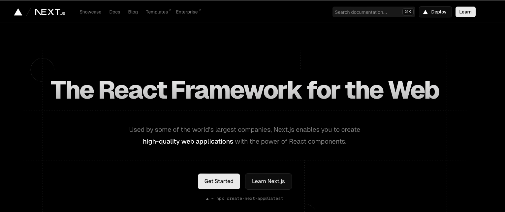

# 리액트에서의 3D 모델 렌더링은 어떻게?

현대 데이터 센터의 복잡성과 규모가 증가함에 따라, 이를 효과적으로 시각화하고 실시간으로 모니터링할 수 있는 솔루션에 대한 기업들의 수요가 급증하고 있었다.  \
이러한 요구에 부응하여, 우리팀은 3D 시각화 기술을 활용하여 데이터 센터의 인프라를 직관적으로 관리할 수 있는 혁신적인 모니터링 솔루션을 개발하고자 했다.\
이번 글에서는  React Three Fiber와 같은 기술 스택을 활용해 \
이러한 솔루션을 제품화하는 과정과 핵심 개념들을 상세히 다루고자 한다.

나는 입사하자마자\
리액트 환경에서 한번도 구현해본적 없는 3D 모델링과 x,y 좌표계를 구현해야만 했다.\
우선 3D 환경을 쉽게 리액트에서 핸들링 할 수 있는 라이브러리를 찾았는데, \
3가지를 찾게 되었다.

```json
@react-three/drei
@react-three/fiber
three
```

[https://github.com/pmndrs/drei](https://github.com/pmndrs/drei)

[https://docs.pmnd.rs/react-three-fiber/getting-started/introduction](https://docs.pmnd.rs/react-three-fiber/getting-started/introduction)



라이브러리를 사용하여, 솔루션 개발을 위해 해당 라이브러리를 어떻게 사용할지 에 대해 막막했기 때문에 \
Udemy 에 강의를 찾아 듣고 조금씩 라이브러리에 대한 이해도를 쌓기 시작했다.

[https://www.udemy.com/course/threejs-using-react/?couponCode=ACCAGE0923](https://www.udemy.com/course/threejs-using-react/?couponCode=ACCAGE0923)

<figure><figcaption><p>강의가 영문으로 되어있었지만,,, 어떻게든 들어야만 했다..</p></figcaption></figure>

Three.js 는 3D 그래픽을 웹 브라우저에서 렌더링하기 위한,  JavaScript 라이브러리로, \
React Three Fiber 는 이를 React 의 컴포넌트 기반 접근 방식과 결합하여 더 쉽게 3D 장면을 구축하고 관리할 수 있도록 도와주는 라이브러리 라는 사실을 알게 되었다.


React. Three Fiber 의 주요 개념들은 아래와 같다.


1. Renderer

React Three Fiber는 Three.js의 WebGLRenderer를 감싸고 있으며, React의 렌더링 사이클과 통합된다.\
이를 통해 React의 상태 변화에 따라 Three.js 장면이 자동으로 업데이트된다.


2. Canvas

컴포넌트는 React Three Fiber 애플리케이션의 진입점으로, \
Three.js의 요소를 생성하고, \
장면(Scene), 카메라(Camera), 조명(Light) 등을 초기화한다.


3. Scene

Three.js의 Scene 객체는 3D 장면을 표현한다.\
React Three Fiber에서는 컴포넌트 내부에 포함된 모든 컴포넌트들이 자동으로 Scene의 하위 객체로 추가된다.


4. Mesh

Mesh는 3D 객체의 기본 단위로, Geometry(형상)와 Material(재질)을 결합하여 생성된다.\
React Three Fiber에서는 컴포넌트를 사용하여 Mesh를 정의한다.


5. Geometry

Geometry는 객체의 형태를 정의한다.\
Three.js에서 제공하는 다양한 Geometry 클래스들이 있으며, React Three Fiber에서는 , \
등의 컴포넌트를 사용한다.


6. Material

Material은 객체의 표면 속성을 정의한다.\
Three.js에서는 다양한 Material 클래스들이 있으며, React Three Fiber에서는 , 등의 컴포넌트를 사용한다.


7. Camera

카메라는 장면을 보는 시점을 정의한다.\
Three.js의 PerspectiveCamera와 OrthographicCamera를 사용할 수 있으며, \
React Three Fiber에서는 컴포넌트를 사용하여 카메라를 정의한다.\


8. Lights

빛은 장면을 밝히는 역할을 한다.\
Three.js의 다양한 빛 클래스들이 있으며, React Three Fiber에서는 \
boxBufferGeometry, sphereBufferGeometry 등의 컴포넌트를 사용한다.


9. Controls

Three.js 장면을 제어하는 다양한 컨트롤러가 있으며, \
React Three Fiber에서는 @react-three/drei와 같은 라이브러리를 통해 쉽게 사용할 수 있다. \
예를 들어, OrbitControls는 카메라를 회전, 줌인/줌아웃할 수 있도록 한다.


```jsx
import { Canvas } from "@react-three/fiber";
```

react-three/fiber 의 Canvas 컴포넌트를 활용하여, \
Ground 와, x,y 좌표를 그릴 수 있는 방법을 찾기 시작하였습니다.


어떻게 해야 Ground 와 x, y 좌표를 3D 환경에서 구현하고, 이것들을 활용하여, \
데이터 기반으로 각 랙들을 올바른 위치에 배치할 수 있을까 고민하기 시작했습니다.


\


\
