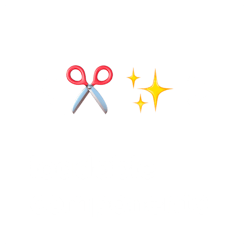

# 코드 스플리팅


### Code Splitting&#x20;

이 기능을 사용하여 코드를 다양한 번들로 분할하고,\
요청에 따라 로드하거나, 병렬로 로드할 수 있습니다. \
더 작은 번들로 만들고, 리소스 우선순위를 올바르게 제어하기 위해, 사용하며, \
잘 활용하면 로드 시간에 큰 영향을 끼칠 수 있습니다.


### 코드 스플리팅을 하는 이유

code splitting 은 코드 분할이다. 어떤 코드를? -> 번들 코드를 분할\
React 같은 SPA 을 개발하고 나면, webpack 같은 번들러로 빌드하고,\
html 파일에서 번들된 js 파일을 불러와서 브라우저에서 실행하게 된다.\
그런데 번 파일이 다 불러워져야 웹앱이 실행되다 보니, \
앱의 크기가 커지면 커질 수록 성능에 영향을 끼치게 된다.\
특히 서드 파티 라이브러리 같은 경우, 크기가 굉장히 큰 경우가 많기 때문에,\
번들 파일도 금방 커진다.\
이 때 고려할 방안은 code splitting 이다.\
이는 번들 파일의 코드를 분할하여, 모든 코드를 한 번에 불러오지 않고,\
사용자가 필요할 때에 필요한 코드만 불러오는 개념이다.


### 코드 스플리팅 3가지 방법

1. Entry Points
2. Prevent Duplication
3. Dynamic Imports


### 1. Entry Points


코드를 분할하는 가장 쉽고 직관적인 방법입니다. \
그러나 다른 방법에 비해 수동적이며, 같이 살펴볼 몇 가지 함정이 있습니다. \
메인 번들에서 다른 모듈을 어떻게 분리하는지 알아보겠습니다.


project

```javascript
webpack-demo
|- package.json
|- package-lock.json
|- webpack.config.js
|- /dist
|- /src
  |- index.js
+ |- another-module.js
|- /node_modules
```

****

**another-module.js**

```javascript
import _ from 'lodash';

console.log(_.join(['Another', 'module', 'loaded!'], ' '));
```

****

**webpack.config.js**

```javascript
const path = require('path');
s
 module.exports = {
// -  entry: './src/index.js',
+  mode: 'development',
+  entry: {
+    index: './src/index.js',
+    another: './src/another-module.js',
+  },
   output: {
// -    filename: 'main.js',
+    filename: '[name].bundle.js',
     path: path.resolve(__dirname, 'dist'),
   },
 };
```

언급했듯이 이 접근 방식에는 몇 가지 함정이 있습니다.

* 엔트리 청크 사이에 중복된 모듈이 있는 경우 두 번들에 모두 포함됩니다.
* 코어 애플리케이션 로직을 통한 코드의 동적 분할에는 사용할 수 없으며 유연하지 않습니다.

이 중 첫 번째 항목을 통해 지금 예제의 문제를 알 수 있습니다. \
왜냐하면 `./src/index.js`에서도 `lodash`를 가져오므로 \
양쪽 번들에서 중복으로 포함되기 때문입니다. \
다음 섹션에서 중복된 것을 제거하겠습니다.


### 2. Prevent Duplication

#### Entry dependencies

기본적으로 모든 엔트리 청는 사용하는 모든 모듈을 저장합니다. \
그러나 dependOn 옵션을 사용하면 청크간 모듈을 공유할 수 있습니다.


**webpack.config.js**

```javascript
 const path = require('path');

 module.exports = {
   mode: 'development',
   entry: {
// -    index: './src/index.js',
// -    another: './src/another-module.js',
+    index: {
+      import: './src/index.js',
+      dependOn: 'shared',
+    },
+    another: {
+      import: './src/another-module.js',
+      dependOn: 'shared',
+    },
+    shared: 'lodash',
   },
   output: {
     filename: '[name].bundle.js',
     path: path.resolve(__dirname, 'dist'),
   },
 };
```

단일 HTML 페이지에서 여러 엔트리 포인트를 사용하는 경우 \
`optimization.runtimeChunk: 'single'`도 필요합니다. \
그렇지 않으면 [여기](https://bundlers.tooling.report/)에서 설명하는 문제가 발생할 수 있습니다.\


**webpack.config.js**

```javascript
 const path = require('path');

 module.exports = {
   mode: 'development',
   entry: {
     index: {
       import: './src/index.js',
       dependOn: 'shared',
     },
     another: {
       import: './src/another-module.js',
       dependOn: 'shared',
     },
     shared: 'lodash',
   },
   output: {
     filename: '[name].bundle.js',
     path: path.resolve(__dirname, 'dist'),
   },
+  optimization: {
+    runtimeChunk: 'single',
+  },
 };
```

\


다음은 빌드 결과입니다.

```javascript
...
[webpack-cli] Compilation finished
asset shared.bundle.js 549 KiB [compared for emit] (name: shared)
asset runtime.bundle.js 7.79 KiB [compared for emit] (name: runtime)
asset index.bundle.js 1.77 KiB [compared for emit] (name: index)
asset another.bundle.js 1.65 KiB [compared for emit] (name: another)
Entrypoint index 1.77 KiB = index.bundle.js
Entrypoint another 1.65 KiB = another.bundle.js
Entrypoint shared 557 KiB = runtime.bundle.js 7.79 KiB shared.bundle.js 549 KiB
runtime modules 3.76 KiB 7 modules
cacheable modules 530 KiB
  ./node_modules/lodash/lodash.js 530 KiB [built] [code generated]
  ./src/another-module.js 84 bytes [built] [code generated]
  ./src/index.js 257 bytes [built] [code generated]
webpack 5.4.0 compiled successfully in 249 ms
```

보시다시피 `shared.bundle.js`, `index.bundle.js` 및 `another.bundle.js` 외에 또 다른 `runtime.bundle.js` 파일이 생성됩니다.

webpack은 하나의 페이지에 여러 엔트리 포인트를 허용하지만, \
가능하다면 `entry: { page: ['./analytics', './app'] }`처럼 \
여러 개의 import가 포함된 엔트리 포인트 사용을 피해야 합니다. \
이는 `async` 스크립트 태그를 사용할 때 최적화에 용이하며 일관된 순서로 실행할 수 있도록 합니다.


#### SplitChunksPlugin

[`SplitChunksPlugin`](https://webpack.kr/plugins/split-chunks-plugin/)을 사용하면 기존 엔트리 청크 또는 완전히 새로운 청크로 공통 의존성을 추출할 수 있습니다. 이를 활용하여 이전 예제의 `lodash` 중복을 제거해 보겠습니다.


**webpack.config.js**

```javascript
  const path = require('path');

  module.exports = {
    mode: 'development',
    entry: {
      index: './src/index.js',
      another: './src/another-module.js',
    },
    output: {
      filename: '[name].bundle.js',
      path: path.resolve(__dirname, 'dist'),
    },
+   optimization: {
+     splitChunks: {
+       chunks: 'all',
+     },
+   },
  };
```

[`optimization.splitChunks`](https://webpack.kr/plugins/split-chunks-plugin/#optimizationsplitchunks) 설정 옵션을 적용하면 \
`index.bundle.js`와 `another.bundle.js`에서 중복 의존성이 제거된 것을 확인 할 수 있습니다.\
&#x20;플러그인은 `lodash`가 별도의 청크로 분리되었고 메인 번들에서도 제거된 것을 알 수 있습니다. \
잘 동작하는지 확인하기 위해 `npm run build`를 실행해 보겠습니다.

```javascript
...
[webpack-cli] Compilation finished
asset vendors-node_modules_lodash_lodash_js.bundle.js 549 KiB [compared for emit] (id hint: vendors)
asset index.bundle.js 8.92 KiB [compared for emit] (name: index)
asset another.bundle.js 8.8 KiB [compared for emit] (name: another)
Entrypoint index 558 KiB = vendors-node_modules_lodash_lodash_js.bundle.js 549 KiB index.bundle.js 8.92 KiB
Entrypoint another 558 KiB = vendors-node_modules_lodash_lodash_js.bundle.js 549 KiB another.bundle.js 8.8 KiB
runtime modules 7.64 KiB 14 modules
cacheable modules 530 KiB
  ./src/index.js 257 bytes [built] [code generated]
  ./src/another-module.js 84 bytes [built] [code generated]
  ./node_modules/lodash/lodash.js 530 KiB [built] [code generated]
webpack 5.4.0 compiled successfully in 241 ms
```

다음은 코드 스플리팅을 위해 커뮤니티에서 제공하는 다른 유용한 플러그인과 로더입니다.

\-[`mini-css-extract-plugin`](https://webpack.kr/plugins/mini-css-extract-plugin) : 메인 애플리케이션에서 CSS를 분리하는데 유용합니다.


### 3. Dynamic Imports

\
webpack은 동적 코드 스플리팅에 두 가지 유사한 기술을 지원합니다. \
첫 번째이자 권장하는 접근 방식은 [ECMAScript 제안을](https://github.com/tc39/proposal-dynamic-import) 준수하는 [`import()`구문](https://webpack.kr/api/module-methods/#import-1)을 사용하는 방식입니다. \
기존의 webpack 전용 방식은 [`require.ensure`](https://webpack.kr/api/module-methods/#requireensure)를 사용하는 것입니다. \
이 두 가지 중 첫 번째를 사용해 보겠습니다.


**Warning**

`import()` 호출은 내부적으로 [promises](https://developer.mozilla.org/en-US/docs/Web/JavaScript/Reference/Global\_Objects/Promise)를 사용합니다. \
이전 브라우저(예: IE 11)에서 `import()`를 사용하는 경우\
[es6-promise](https://github.com/stefanpenner/es6-promise)나 [promise-polyfill](https://github.com/taylorhakes/promise-polyfill)과 같은 폴리필을 사용하여 `Promise`를 지원하도록 해야 합니다.\


#### 동적 import 를  왜 사용하는가?

dynamic import 는 동적 불러오기 이다. \
기존에 코드 파의 가장 상위에서 import 구문을 사용하여 불러오는 것을\
static import (정적 불러오기) 라고 한다.\
정적 불러오기 같은 경우 문서의 가장 상위에 위치해야 하고, \
블록문 안에 위치할 수 없는 제약사항이 있다.\
동적 블러오기는 import() 구문을 사용하는데, Promise 객체를 반환한다.\
Promise 객체의 반환값은 블러온 모듈이다.\
함수를 호출하는 문법을 취하고 있지만, import 는 함수가 아니다\
동적 불러오기는 코드의 위치에 관계없이 사용이 가능하기 때문에,\
모듈들을 사용자가 필요로 할 때 불러오게끔 할 수 있다.


#### React.lazy

리엑트에서 컴포넌트 파일을 정의하고 동적 불러오기를 사용하면 에러가 발생한다.\
컴포트를 동적으로 불러오기 위해서는 React.lazy 를 사용해야 한다.\
React.lazy() 메서드를 사용하면 동적 가져오기를 사용하여 구성 요소 수준에서\
React 앱을 쉽게 코드 분할 할 수 있습니다.\
React.lazy() 는 import() 구문을 반환하는 콜백 함수를 인자로 받습니다.\
동적으로 불러오는 컴포넌트 파일에는 반드시 지켜줘야 하는 2개의 규칙이 있습니다.\
1\. React 컴포넌트를 포함해야 합니다.\
2\. default export 를 가진 컴포넌트여야 합니다.

```javascript
const About = React.lazy(() => import('./About'));
```

\


Suspense 컴포넌트를 사용하여 lazy 컴포트를 감쌉니다.\
lazy 컴포넌트는 Suspense 컴포넌트 하위에서 렌더링 되어야 하며,\
Suspense 는 lazy 컴포넌트가 로드되길 기다리는 동안 \
로딩 화면과 같은 예비 컨텐츠를 fallback 이라는 prop 에서 보여줄 수 있게 해줍니다.

```jsx
<Suspense fallback={<div>Loading...</div>}>
  <Routes>
    <Route path="/" element=<About/>} />
  </Routes>
</Suspense>
```


#### 서버 사이드 렌더링을 사용했을 때 문제점

1. 서버에는 리렌더링이 없음\
   서버사이드 렌더링에서는 리렌더링라는게 없다. \
   서버사이드 렌더링에서는 우리가 컴포넌트를 문자열 형식으로 렌더링하는데.. \
   도중에 state 가 바뀐다고 해서 문자열이 혼자 바뀌지는 않습니다. \
   이에 대한 해결 방법으로는 서버에서는 코드스플리팅을 아예 적용하지 않는 방법이 있습니다. \
   프로덕션 브라우저 코드에서만 코드 스플리팅된 index.js 를 사용하도록 하면 이 문제를 쉽게 해결 할 수 있습니다. 이는 웹팩의 NormalModuleReplacementPlugin 라는 플러그인을 사용하여 적용 할 수 있습니다.\

2. 페이지 깜박임 현상\
   위 문제를 해결하고 나면 발생 할 수 있는 문제점은, 페이지 깜박임 현상입니다. \
   이 현상은 코드 스플리팅과 서버사이드 렌더링을 함께 하게 될 때 다음 흐름으로 진행되기 때문에 발생합니다

#### 코드스플리팅 & 서버사이드 렌더링&#x20;

서버에서 HTML 을 생성해서 클라이언트에게 전달해줍니다.\
클라이언트는 전달받은 HTML 을 페이지에 일단 보여줍니다.\
JavaScript 가 실행이 됩니다. \
처음에는 스플리팅된 코드가 아직 로딩되어있지 않은 상태입니다. \
따라서, null 이 렌더링되면서 기존에 보여줬었던게 사라집니다.\
컴포넌트를 로딩 한 다음에는 다시 렌더링을 합니다.

위와 같은 흐름으로 작동하기 때문에, 깜박임 현상이 발생하게 되는데요.. \
이를 방지하기 위해선 사전에 어떤 경로로 들어왔을때 \
어떤 컴포넌트를 불러와야하는지 따로 정의해놓고, \
코드 로딩이 끝난다음에 ReactDOM.render 함수를 호출 하는 것 입니다.


#### 또 다른 해결 방법 Loadable Components

<figure><figcaption></figcaption></figure>

```shell
npm i @loadable/component
```

<figure><figcaption></figcaption></figure>

Loadable Components 는 코드 분할을 편하게 하도록 도와주는 서드파티 라이브러리 이다. \
가장 큰 장점은 서버 사이드 렌더링을 지원한다. \
렌더링 하기 전에 필요할 때 분할된 파일을 미리 불러올 수 있는 기능도 있다.

```jsx
const Page1 = loadable(() =>
  import(/* webpackChunkName: "page1" */ "./pages/page1")
);
```

[https://loadable-components.com/docs/api-loadable-component/](https://loadable-components.com/docs/api-loadable-component/)

\


webpack.config.js

```javascript
// webpack.config.js 의 output 부분만 보려고 한다.
  output: {
    path: path.resolve(__dirname, "./dist"),
    filename: (pathData) => {
      if (isDevelopment) {
        return "[name].js";
      }
      const { name } = pathData.chunk;
      return name !== "app" ? "vendors/[name].js" : "[name].[contenthash:8].js";
    },
    chunkFilename: (pathData) => {
      if (isDevelopment) {
        return "[name].js";
      }
      if (pathData.chunk.name === "page1") {
        return "[name].[contenthash:8].js";
      } else {
        return "vendors/[name].js";
      }
    },
    assetModuleFilename: "assets/[contenthash:8][ext][query]",
    clean: true, // 내보내기 전에 output 디렉터리를 정리합니다.
  },
```

loadable() 를 호출할 때 주석으로 작성해줬던 \
/\* webpackChunkName: "page1" \*/ 라고 작성해줬던 부분은\
pathData.chunk.name 에서 참조할 수 있다.


#### output.chunkFilename

이 옵션은 초기가 아닌 청크 파일의 이름을 결정합니다.\
청크 파일 요청을 위해 런타임에서 파일 이름을 생성해야합니다.

```javascript
module.exports = {
  //...
  output: {
    chunkFilename: (pathData) => {
      return pathData.chunk.name === 'main' ? '[name].js' : '[name]/[name].js';
    },
  },
};
```

